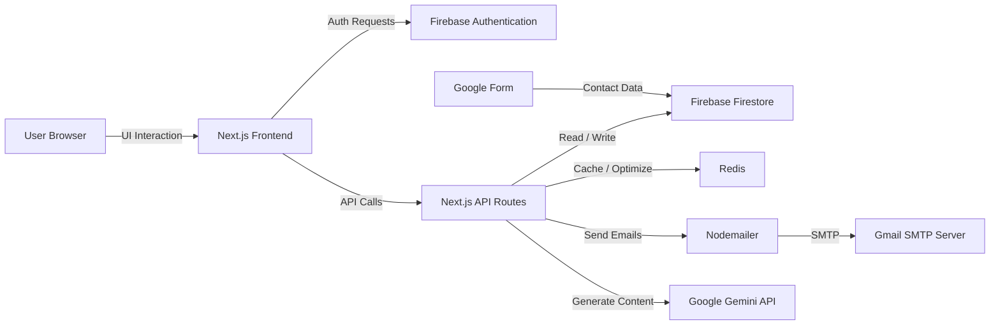

# 📧 EmailManager– Email Management System

EmailManager is a full-stack **Email Management System** built with **Next.js** that allows users to create, manage, and send bulk emails using customizable and AI-generated templates. It includes secure authentication, contact and group management, email logging, and Google Form integration for easy contact collection.


🔗 Live Demo: https://mailvora.vercel.app

👤 Demo Account  
Email: saraswati13122002@gmail.com  
Password:Saraswati@13

---

## 🚀 Features

### 🚀 Redis Integration
- Uses Redis (Upstash) to store temporary data such as secure invite tokens with automatic expiration (TTL), improving performance and security.
 
---

### 🔐 Authentication
- Secure **Login & Signup**
- Firebase Authentication
- User-specific data isolation

---

### ✉️ Email API Integration
- Gmail SMTP integration using **Nodemailer**
- Server-side email sending via Next.js API routes
- Supports sending and receiving emails

---

### 📝 Template Management
- Create new email templates
- Edit and delete templates
- Dynamic content using input fields
- **AI-generated templates** using **Google Gemini API**

---

### 🗄️ Template Storage
- Templates stored securely in **Firebase Firestore**
- Full CRUD operations
- User-based access control

---

### 👥 Contact Management
- Add, edit, and delete contacts
- Store contact details securely
- Organize contacts into groups

---

### 📂 Group Management
- Create, edit, and delete groups
- View contacts inside a group
- Select groups for bulk email sending

---

### 📤 Bulk Email Sending
- Select an email template
- Send emails to multiple contacts or groups in one action
- Optimized using **Redis**

---

### 📜 Email Logs
- Track sent emails
- Logs include:
  - Recipient(s)
  - Template used
  - Timestamp

---

### 🔗 Google Form Integration
- Generate a shareable Google Form link
- Collect contact information easily
- Add collected data directly to contacts

---

### 🧠 AI Integration
- Google Gemini API for email template generation
- Prompt-based professional email creation

---

## 🛠️ Tech Stack

| Layer | Technology |
|------|-----------|
| Frontend | Next.js (App Router) |
| Styling | Tailwind CSS |
| Backend | Next.js API Routes |
| Database | Firebase Firestore |
| Authentication | Firebase Auth |
| Email | Gmail SMTP (Nodemailer) |
| Caching | Redis |
| AI | Google Gemini API |

---


## 🏗️ System Architecture Diagram




## 📦 Installation & Setup

### 1️⃣ Clone the repository
```bash
git clone https://github.com/saru0213/EmailManager.git
cd EmailManager

```
